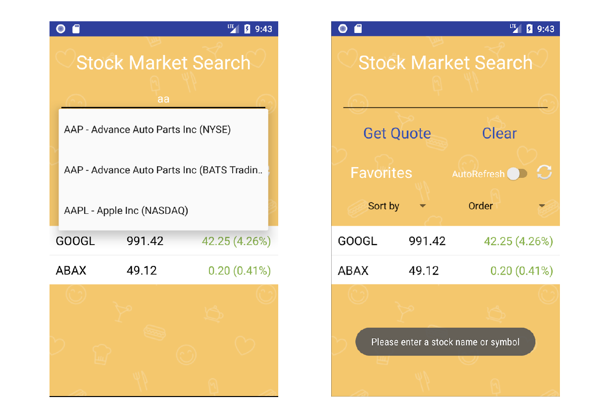
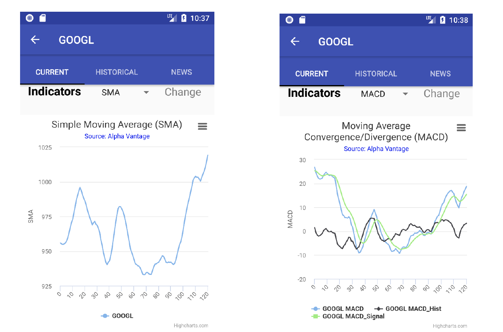
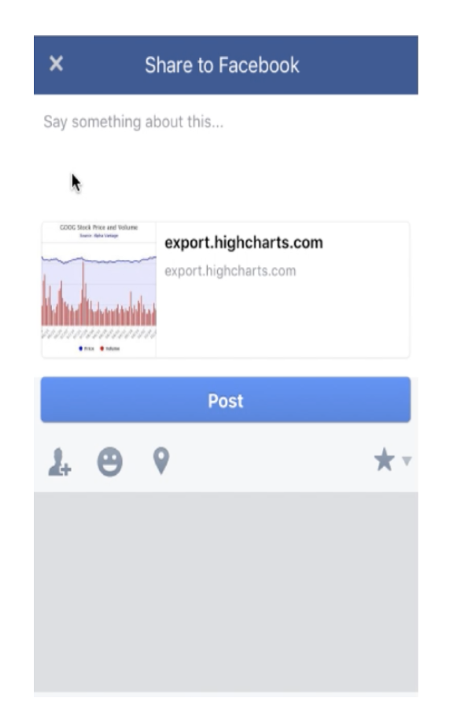

# Stock-Search-Android-Application

This Android app was made as part of course CSCI 571 (Web Technologies) in Fall 2017 at USC. 
A working demo of my app can be found here : https://www.youtube.com/watch?v=8DP2pqdeA3A&t=11s

I have developed an Android Mobile application, which allows users to search for stock information, save some stock symbols
as favorites, and post the stock charts to their Facebook timeline. The backend service is written in PHP and is deployed on Amazon Web Services.

The main screen of this app is where the user can enter the stock ticker symbol and select from a list of matching stock symbols using “autocomplete.” A “stock quote” on a matched stock symbol is retrieved.

Once the validation is successful, stock details would be retrieved using the PHP script hosted on AWS, which would return the result in JSON format. The stock details would be displayed in a ListView component in the ‘Current’ tab. Furthermore, the
PHP script would be responsible for rendering the HighCharts in the ‘Current’ and ‘Historical’
tabs and also rending the news articles in the ‘News’ tab.

The main screen also has a Switch implemented as an AutoRefresh element. Next to the switch is an Android icon to refresh the data. There are 2 spinners, one to sort the list and the other to order the list based on some parameter. There is also a Favorite ListView showing the list of favorite stocks.

The stock details and charts are displayed in the 'Current' tab of the app. WebView is used to display the chart. It also has a “Facebook” icon, that allows users to post the current stock chart shown in the app on their timeline.

